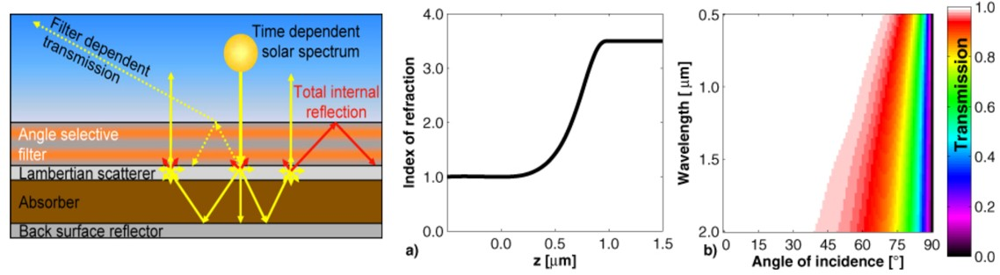
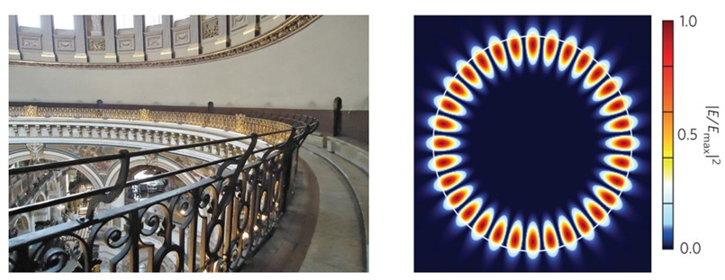

# Optical modelling and Simulation workshop - Luxembourg 2026
This repository provides the packages and assigments for the lecture *Optical Simulation and Modelling*  at **Optics of Solar Cell 2026 workshop at Laboratory of Photovoltaics, UNIVERSITÉ DU LUXEMBOURG**.

The lecture focuses on describing few numerical techniques like Transfer Matrix Method (TMM), Finite Element Method (FEM), Finite-Difference Time and Frequency Domain method (FDTD and FDFD) that are often used by researchers in reference to a prototypical solar cell example. General idea would be to understand which computation method works best for their given problem and how to extract meaningful photovoltaic metrics through these simulations through appropriate geometrical considerations.

To get started with the assignment, use the `launch binder` icon above and look at the two notebooks.

 Please note : Since the Binder version runs on the cloud, it will delete your progress and the generated files within 2-3 hours of an active session and **within 10 minutes** of an inactive/idle session. Please save your notebooks, scripts and plots regularly to avoid data loss and progress. 

## Task 1 : Gradient refractive index for solar cells
It is commonly accepted in the photovoltaics community that a gradient refractive index profile can outperform a standard anti-reflection coating of same thickness in increasing the incoupling of light into the solar cell. It does so by gradually decreasing the impedance mismatch at each sub-layer thereby minimizing reflection from the front-interface. The refractive index smoothly varies from $n_{absorber}$ to $n_{air}$ as a function of distance above the semiconductor. 

There are several ways to create a smooth gradient in the refractive index n(h), where n is the refractive index at height h above the substrate. One of the methods is to create a quintic refractive index profile where the refractive index is dependent on 5th order polynomial of the height [**[1]**](https://doi.org/10.1364/OE.16.009332).

    
Use the Transfer Matrix Method (TMM) code provided to you in this repository (`TMM.py`) for simulating a quintic refractive profile above a semi-infinite absorbing cSi layer and show that it can minimize back-reflection at normal incidence. The refractive index of your coating must smoothly vary from $n_{max}=3.5$ to $n_{min}=1$. 
1. Determine the coefficients for the quintic polynomial
2.  Compare your results with an anti-reflection coating of same thickness and refractive index n=1.5. Keep the thickness of the coating (consisting of 50-100 sub-layers) to be $d=0.6\mu\text{m}$.

**An example of the usage can be found in `tmm_assignment.ipynb`**

## Task 2 Scattering from cylindrical obstacle
Whispering gallery modes (WGMs) are resonances that occur when waves, acoustic or electromagnetic, are confined due to continuous total internal reflection along a curved boundary. These modes form standing wave patterns with high quality factors, enabling strong field localization predominantly near the perimeter of circular or cylindrical structures. A common example of this phenomenon is seen in the Whispering Gallery of St Paul’s Cathedral (figure below), where even faint whispers can travel clearly across the dome due to the acoustic WGMs supported by the circular architecture. 

Researchers have created nanoscale dielectric resonators of $\text{ZnO}$, $\text{SiO}_2$, $\text{TiO}_2$ to excite such Mie resonances and used it for light trapping in solar cells. These nanostructures diffractively couple incident sunlight into WGM modes, circulating it within the active material thus increasing the optical path length and thereby higher photocurrent [**[2]**](https://doi.org/10.1039/C3CP53162G).

Use the Mie code `mie_coefficients.py` provided to you to study the scattering from an infinitely long dielectric cylinder in the Mie regime. Use this paper for your reference [**[3]**](http://dx.doi.org/10.2528/PIER97071100).

1. For an infinite cylinder with radius $r=0.45\mu\text{m}$ and refractive index $n=2.31$, determine a wavelength $\lambda=\lambda_0$ for TE polarization at which a WGM can be excited.
2. Repeat the procedure from (1) but with refractive index $n=2.745$ and radius $r=0.3\mu\text{m}$. At what wavelength and mode number can you excite a whispering gallery mode with these parameters.

**An example of the usage can be found in `mie_assignment.ipynb`**
